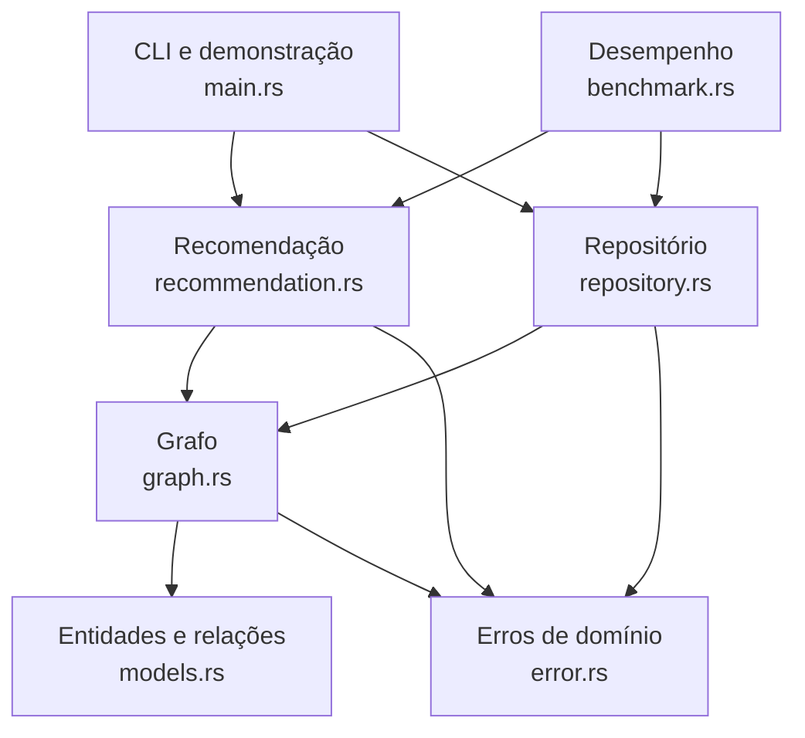

# ConectaStore

Sistema acadêmico de recomendação de produtos baseado em grafos, desenvolvido em Rust. O ConectaStore representa clientes, produtos e categorias como vértices e utiliza as relações entre esses elementos para gerar recomendações explicáveis.

O projeto funciona inteiramente em memória e disponibiliza uma demonstração por linha de comando, testes automatizados e um cenário reproduzível para medição de desempenho.

## Sumário

- [Problema](#problema)
- [Funcionalidades](#funcionalidades)
- [Tecnologias](#tecnologias)
- [Estruturas de dados](#estruturas-de-dados)
- [Arquitetura](#arquitetura)
- [Organização dos arquivos](#organização-dos-arquivos)
- [Modelagem do grafo](#modelagem-do-grafo)
- [Algoritmo de recomendação](#algoritmo-de-recomendação)
- [Pré-requisitos](#pré-requisitos)
- [Compilação e execução](#compilação-e-execução)
- [Testes e qualidade](#testes-e-qualidade)
- [Medição de desempenho](#medição-de-desempenho)
- [Exemplo de uso](#exemplo-de-uso)
- [Limitações](#limitações)
- [Melhorias futuras](#melhorias-futuras)
- [Vídeo pitch](#vídeo-pitch)
- [Autor](#autor)
- [Licença](#licença)

## Problema

Recomendações limitadas aos produtos mais vendidos ou a itens da mesma categoria não consideram adequadamente o histórico e os interesses de cada cliente. O ConectaStore trata esse problema por meio de um grafo capaz de representar compras, interesses, avaliações, categorias e similaridades entre produtos.

A recomendação percorre essas conexões, calcula uma pontuação e informa o motivo associado ao resultado. Produtos indisponíveis, já comprados ou repetidos são removidos conforme o contexto da busca.

## Funcionalidades

- cadastro e consulta de clientes, produtos e categorias;
- validação de identificadores únicos;
- criação e atualização de conexões ponderadas;
- validação da compatibilidade entre os tipos de vértice e relacionamento;
- registro de compra, interesse, avaliação, categoria e similaridade;
- recomendação a partir de um cliente;
- recomendação a partir de um produto;
- configuração do limite de resultados, profundidade e decaimento por distância;
- exclusão de produtos indisponíveis e produtos já comprados;
- eliminação de recomendações duplicadas;
- ordenação determinística por pontuação e identificador;
- exibição da pontuação, categoria e motivo da recomendação;
- geração determinística de dados sintéticos;
- medição do tempo de construção, consulta e recomendação;
- testes unitários e de integração.

## Tecnologias

- **Rust 2021:** linguagem de implementação;
- **Cargo:** compilação, execução, testes e gerenciamento do projeto;
- **biblioteca padrão do Rust:** todas as estruturas e medições utilizadas;
- **Git e GitHub:** versionamento e publicação do código.

O projeto não possui dependências externas no arquivo `Cargo.toml`.

## Estruturas de dados

| Estrutura   | Uso no projeto                                                | Justificativa                                                             |
| ----------- | ------------------------------------------------------------- | ------------------------------------------------------------------------- |
| `HashMap`   | armazenamento dos vértices, listas de adjacência e candidatos | permite acesso médio próximo de `O(1)` por identificador                  |
| `Vec<Edge>` | lista de arestas de cada vértice                              | é adequada para percorrer sequencialmente os vizinhos de um grafo esparso |
| `VecDeque`  | fila da busca em largura                                      | permite inserção no final e remoção no início de forma eficiente          |
| `HashSet`   | visitados, produtos comprados e produtos únicos               | oferece verificação média próxima de `O(1)` e impede repetições           |
| `Vec`       | resultados finais                                             | permite ordenar o ranking e aplicar o limite de recomendações             |

## Arquitetura

O sistema adota uma arquitetura modular em camadas simples:



Responsabilidades dos módulos:

| Módulo                    | Responsabilidade                                                               |
| ------------------------- | ------------------------------------------------------------------------------ |
| `models.rs`               | define identificadores, entidades, vértices, arestas e tipos de relacionamento |
| `graph.rs`                | armazena e valida o grafo, as listas de adjacência e o índice reverso          |
| `repository.rs`           | oferece operações de cadastro, consulta e conexão sobre o grafo                |
| `recommendation.rs`       | executa a busca, calcula pontuações, filtra e ordena recomendações             |
| `benchmark.rs`            | gera cenários sintéticos e mede os tempos de execução                          |
| `error.rs`                | centraliza os erros de domínio e suas mensagens                                |
| `lib.rs`                  | expõe os módulos que formam a biblioteca `megastore`                           |
| `main.rs`                 | monta e executa a demonstração reproduzível no terminal                        |
| `examples/performance.rs` | executa as medições de desempenho em modo de release                           |

## Organização dos arquivos

```text
megastore/
├── examples/
│   └── performance.rs
├── src/
│   ├── benchmark.rs
│   ├── error.rs
│   ├── graph.rs
│   ├── lib.rs
│   ├── main.rs
│   ├── models.rs
│   ├── recommendation.rs
│   └── repository.rs
├── tests/
│   ├── graph_integration_test.rs
│   └── recommendation_integration_test.rs
├── .gitignore
├── Cargo.lock
├── Cargo.toml
└── README.md
```

O diretório `target/` é gerado pelo Cargo durante a compilação e não deve ser versionado.

## Modelagem do grafo

O ConectaStore utiliza um grafo **heterogêneo, direcionado, ponderado e esparso**, armazenado como lista de adjacência.

### Vértices

Os identificadores são representados pelo enum `NodeId`:

```rust
enum NodeId {
    Client(u64),
    Product(u64),
    Category(u64),
}
```

O tipo presente no identificador impede, por exemplo, que o produto `1` seja confundido com o cliente `1`.

| Vértice   | Dados principais                             |
| --------- | -------------------------------------------- |
| Cliente   | identificador e nome                         |
| Produto   | identificador, nome, preço e disponibilidade |
| Categoria | identificador e nome                         |

### Arestas

Cada aresta contém destino, tipo de relacionamento e peso normalizado entre `0.0` e `1.0`.

| Origem  | Destino   | Relacionamento                      | Fator usado na pontuação |
| ------- | --------- | ----------------------------------- | -----------------------: |
| Cliente | Produto   | compra (`Purchase`)                 |                     1,00 |
| Cliente | Produto   | interesse (`Interest`)              |                     0,80 |
| Cliente | Produto   | avaliação (`Rating`)                |                     0,90 |
| Produto | Categoria | pertencimento (`BelongsToCategory`) |                     0,60 |
| Produto | Produto   | similaridade (`Similarity`)         |                     1,00 |

O grafo mantém:

- uma lista de adjacência para as arestas de saída;
- um índice reverso para percorrer arestas de entrada sem transformar o grafo em não direcionado.

Uma conexão repetida com a mesma origem, destino e tipo atualiza o peso existente. Dessa forma, a operação não cria arestas duplicadas. Uma similaridade recíproca pode ser representada registrando uma aresta em cada direção.

### Lista de adjacência

A lista de adjacência foi escolhida porque o domínio tende a formar um grafo esparso: cada vértice se conecta a uma pequena parte do total. Seu consumo de memória é `O(V + E)`, enquanto uma matriz de adjacência exige `O(V²)`. A matriz oferece consulta direta de uma posição, mas seria pouco adequada aos volumes considerados neste trabalho.

## Algoritmo de recomendação

O mecanismo usa BFS — Busca em Largura — com profundidade máxima configurável. A busca começa em um cliente ou produto e percorre tanto conexões de saída quanto de entrada. Isso permite encontrar padrões como produtos comprados por clientes que também se relacionam com o item de origem.

Para cada passo da busca, a pontuação é calculada por:

```text
nova_pontuação = pontuação_atual × peso_da_aresta × fator_da_relação × decaimento_da_distância
```

Na configuração da demonstração:

- profundidade máxima: `3`;
- limite de resultados: `5`;
- decaimento por distância: `0.85`.

Quando o mesmo produto é alcançado por caminhos diferentes, permanece a maior pontuação encontrada, juntamente com o motivo correspondente. O sistema não soma as pontuações dos caminhos.

### Fluxo resumido

1. Validar origem e configuração.
2. Inserir a origem na fila `VecDeque`.
3. Retirar o próximo estado da fila.
4. Interromper a expansão quando a profundidade máxima for atingida.
5. Percorrer as arestas de saída e entrada.
6. Calcular a pontuação de cada novo passo.
7. Registrar produtos válidos no mapa de candidatos.
8. Descartar indisponíveis, comprados, repetidos ou o produto de origem.
9. Ordenar por pontuação decrescente e, nos empates, por ID crescente.
10. Aplicar o limite e retornar o ranking.

O custo do BFS sobre a região alcançada é `O(V + E)`. A ordenação de `P` candidatos custa `O(P log P)`. O espaço auxiliar da busca é `O(V + P)`.

## Pré-requisitos

- Rust estável com Cargo;
- Git, caso o projeto seja obtido pelo GitHub;
- no Windows com toolchain MSVC, as ferramentas de compilação C++ do Visual Studio Build Tools.

Confirme a instalação:

```powershell
rustc --version
cargo --version
git --version
```

Clone o repositório e acesse a pasta que contém o `Cargo.toml`:

```powershell
git clone https://github.com/felipemageste92/ConectaStore.git
cd ConectaStore
```

Se a pasta do projeto estiver dentro de outro diretório, entre nela antes de executar qualquer comando Cargo. O Cargo procura o arquivo `Cargo.toml` no diretório atual ou em seus diretórios-pai.

## Compilação e execução

Compile o projeto:

```powershell
cargo build
```

Execute a demonstração:

```powershell
cargo run
```

Para uma compilação otimizada:

```powershell
cargo build --release
cargo run --release
```

## Testes e qualidade

Execute toda a suíte:

```powershell
cargo test
```

Na execução registrada para este projeto, foram aprovados **21 testes**:

- 16 testes unitários;
- 2 testes de integração do grafo;
- 3 testes de integração da recomendação;
- 0 falhas.

Verifique a compilação de todos os alvos:

```powershell
cargo check --all-targets
```

Confira a formatação sem alterar arquivos:

```powershell
cargo fmt --check
```

Para formatar automaticamente:

```powershell
cargo fmt
```

Execute o Clippy e trate avisos como erros:

```powershell
cargo clippy --all-targets -- -D warnings
```

## Medição de desempenho

O exemplo de desempenho deve ser executado em modo `release`:

```powershell
cargo run --release --example performance
```

O gerador cria cenários sintéticos determinísticos. A medição separa:

- construção do grafo, em milissegundos;
- consulta de um produto por ID, em microssegundos;
- geração das recomendações, em milissegundos;
- quantidade de vértices, arestas e candidatos encontrados.

### Resultados obtidos

| Produtos | Vértices | Arestas | Candidatos | Construção (ms) | Consulta (µs) | Recomendação (ms) |
| -------: | -------: | ------: | ---------: | --------------: | ------------: | ----------------: |
|      100 |      111 |     229 |         99 |           0,149 |         0,000 |             0,068 |
|    1.000 |    1.110 |   2.299 |        210 |           0,974 |         0,000 |             0,112 |
|   10.000 |   11.100 |  22.999 |        312 |          11,011 |         0,100 |             0,210 |
|  100.000 |  111.000 | 229.999 |        310 |         170,179 |         0,200 |             0,394 |

Esses valores correspondem a uma execução observada e podem variar conforme processador, sistema operacional, carga da máquina e versão do compilador. Os valores `0,000 µs` indicam que o tempo ficou abaixo da resolução apresentada, e não que a operação tenha custo literalmente nulo.

O experimento demonstra crescimento do tempo de construção à medida que vértices e arestas aumentam. Nos cenários medidos, a consulta por identificador e a recomendação permaneceram curtas, mas os números não constituem um benchmark científico: não foram registradas múltiplas repetições, dispersão estatística ou consumo de memória.

## Exemplo de uso

A demonstração de `main.rs` cria:

- clientes Ana e Bruno;
- categorias Informática e Acessórios;
- produtos Notebook, Mouse sem fio, Teclado mecânico e Monitor;
- conexões de compra, interesse, categoria e similaridade.

Depois, solicita recomendações para a cliente Ana e para o produto Notebook.

### Exemplo de saída

```text
ConectaStore - demonstracao reproduzivel

Recomendacoes para Ana (cliente 1):
ID: 104 | Monitor | Categoria: Informatica | Pontuacao: 0.6502 | Motivo: produto similar
ID: 103 | Teclado mecanico | Categoria: Acessorios | Pontuacao: 0.5527 | Motivo: compras em comum
ID: 102 | Mouse sem fio | Categoria: Acessorios | Pontuacao: 0.5440 | Motivo: interesse relacionado

Recomendacoes a partir de Notebook (produto 101):
ID: 104 | Monitor | Categoria: Informatica | Pontuacao: 0.7650 | Motivo: produto similar
ID: 103 | Teclado mecanico | Categoria: Acessorios | Pontuacao: 0.6502 | Motivo: compras em comum
ID: 102 | Mouse sem fio | Categoria: Acessorios | Pontuacao: 0.4624 | Motivo: interesse relacionado
```

## Limitações

- todos os dados são mantidos somente em memória;
- a aplicação executa uma demonstração automática e não possui menu interativo, API ou interface gráfica;
- não há autenticação, concorrência ou transações;
- avaliações precisam chegar com peso já normalizado entre `0.0` e `1.0`; não há conversão automática da escala de 1 a 5;
- os fatores dos relacionamentos são fixos e não há aprendizado de máquina;
- quando existem vários caminhos para o mesmo produto, somente a maior pontuação é mantida;
- o controle de visitados expande cada vértice uma única vez durante o BFS;
- nomes vazios não são validados;
- a categoria é ligada ao produto por uma operação separada e não é obrigatória no momento do cadastro;
- a medição de desempenho não calcula consumo de memória, médias ou intervalos de confiança.

## Melhorias futuras

- adicionar persistência e importação de dados;
- disponibilizar API e interface para operação do sistema;
- converter avaliações de 1 a 5 para pesos normalizados;
- considerar frequência, tempo e diversidade nas recomendações;
- reexpandir um vértice quando um caminho de pontuação superior for encontrado;
- selecionar os melhores resultados sem ordenar todos os candidatos;
- criar índices adicionais para vértices com grau elevado;
- ampliar o benchmark com repetições, estatísticas e medição de memória;
- estudar cache, particionamento e processamento paralelo para volumes maiores.

## Vídeo pitch

Link: **[Vídeo pitch](https://www.youtube.com/watch?v=hovBg8_coWA)**

## Autor

**Felipe Mageste França**

## Licença

Projeto desenvolvido para fins acadêmicos. Nenhuma licença de código aberto foi definida no repositório até o momento.
